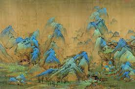

## Ideation

 

When I first looked at landscape painting 'A Thousand Miles of Rivers and Mountains' by the talented artist Wang Ximeng, I was struck with inspiration. I thought it would be fascinating to merge the worlds of art, nature, and code and create a digital artwork. The painting perfectly embodies the Zen philosophy of living in harmony with nature and reflects the cultural heritage of China's appreciation for the natural beauty of its landscapes.

To enhance the natural element, I added a calm ambient soundtrack that plays when the user clicks on the screen. I also made the color of the river change based on the movement and location of the mouse, resulting in a dynamic and interactive experience. By moving the mouse to the four corners of the screen, users can observe the seasonal changes represented by the different colors of the river.

This digital artwork is a mesmerizing display of the beauty of nature and the power of technology. It seamlessly integrates art, nature, and code, showcasing the endless possibilities of combining these elements. 

## Link

<iframe width="400" height="400" src="https://editor.p5js.org/BarneyCodes/full/2eES4fBEL"></iframe>

I got inspiration from the use of noise() from BarneyCodes

## Testing
Instruction:

- Click anywhere in the canvas to operate ambient sound
- Move the mouse to each corner to see colour changes ( 4 corners = 4 different colours) 

<iframe width="600" height="600"src="https://editor.p5js.org/whateverimsandy/full/Gc1F6q3PV"></iframe>

