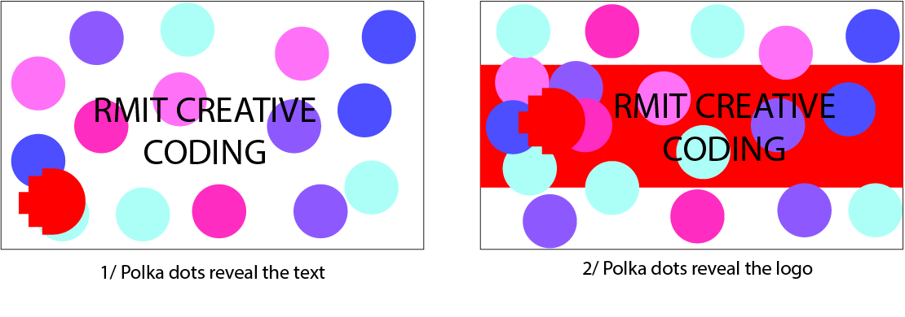

# Ideation & Iterations
The RMIT logo was inspired by the nature in Australia, having a diverse range of insects and spiders in ecosystem. One thing that caught my attention when first visitng Melbourne Museum was the redback spider. Finding the red spot at the back is kind of similar to RMIT logo, I decided why not having it in the banner design 
My ideal was to have to RMIT logo stays hidden until the background transforms.

## Design iteration

### 3 versions of spider with logo (created using Adobe Illustrator)
 
### 4 versions of RMIT logo (created using Adobe Illustrator)
 
### Banner sketches
 

For the first design trail I combined the logo with the spider together by having the logo on the back of the spider but then I realize it would be difficult to actually recognize it since the size wouldn't be that big
For the second trial, I just reversed the 2 characters. Having the spider inside the logo and additionally to create a mysterious element I set the spider to transparent. So when the background gets colorful ir will reveal the spider inside the logo 

# Used functions & techniques
<iframe width="400" height="400"src="https://editor.p5js.org/codingtrain/full/0kQ9v-bhM"></iframe>

Variable

createGraphics()

extraCanvas

random()

# Testing
<iframe width="700" height="400"src="https://editor.p5js.org/whateverimsandy/full/Q-xE0j_Pa"></iframe> 

# Links
https://editor.p5js.org/codingtrain/sketches/0kQ9v-bhM
https://editor.p5js.org/whateverimsandy/sketches/Q-xE0j_Pa 

