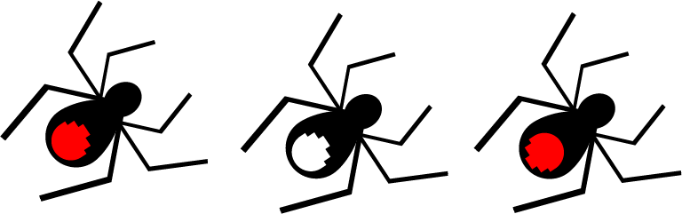
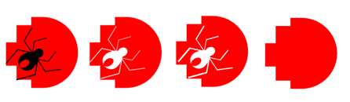

# Ideation
The RMIT logo was inspired by the nature in Australia, having a diverse range of insects and spiders in ecosystem. One thing that caught my attention when first visitng Melbourne Museum was the redback spider. Finding the red spot at the back is kind of similar to RMIT logo, I decided why not having it in the banner design 
My ideal was to have to RMIT logo stays hidden until the background transforms.

## Design iteration
 
 3 versions of spider with logo (created using Adobe Illustrator)

 

 
4 versions of RMIT logo (created using Adobe Illustrator)

# Used functions & techniques

# Testing
<iframe width="700" height="400"src="https://editor.p5js.org/whateverimsandy/full/Q-xE0j_Pa"></iframe> 

