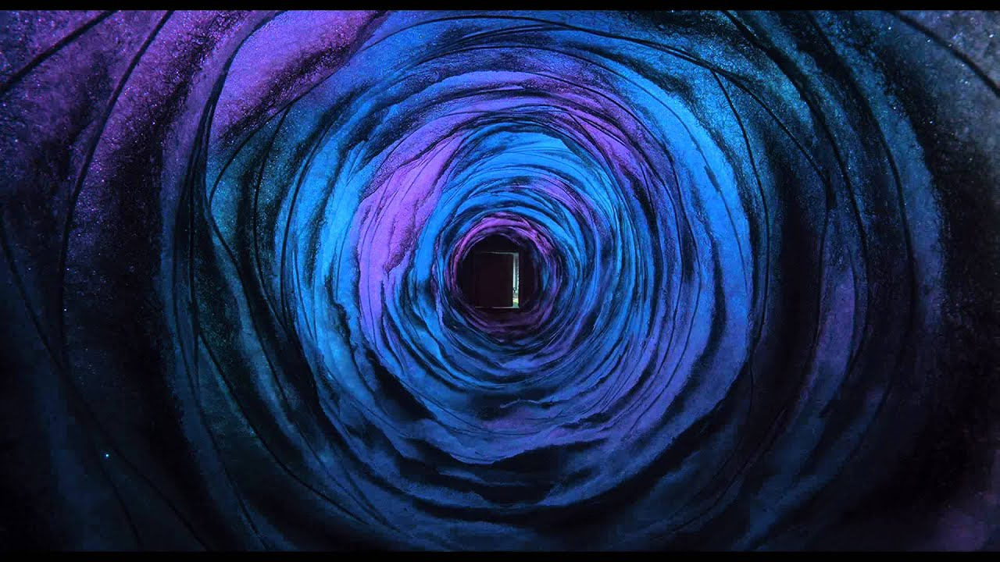
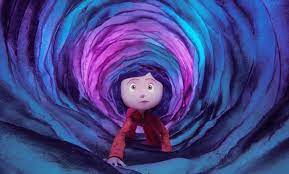

# Ideation

My idea was to have the background tranforms from a blank canvas that later on reveal a hidden message 'RMIT creative coding specialisation' underneath. Taking inspiraton from the stop-motion movie 'Coraline', there's a scene the mysterious tunnel appears leading her to a parallel world. I think it'll be interesting to have influence from this artform into my sketch

 

 

My banner ideation is to place the text (in white colour) into a blank canvas. After interaction (clicking to logo). A squirling line will appear and fully cover the canvas like a spider-web

 # Used functions

 From The Coding Train (drag the canvas to operate)

 <iframe width="600" height="400" src="https://editor.p5js.org/codingtrain/full/1y_xfueO"></iframe>

 -class

 -array

 -mousePressed()/mouseDragged()

 These are the functions that I learnt from The Coding Train. The style is also an inspiration for this experiment

# Testing
The background transformation (click the icon to operate)
<iframe width="600" height="400" src="https://editor.p5js.org/whateverimsandy/full/VADwDnL1a"></iframe>
My p5js sketch

# Links
https://editor.p5js.org/codingtrain/full/1y_xfueO
https://editor.p5js.org/whateverimsandy/full/VADwDnL1a

click to see the squares

<canvas id=onclick_example></canvas>

type to start

